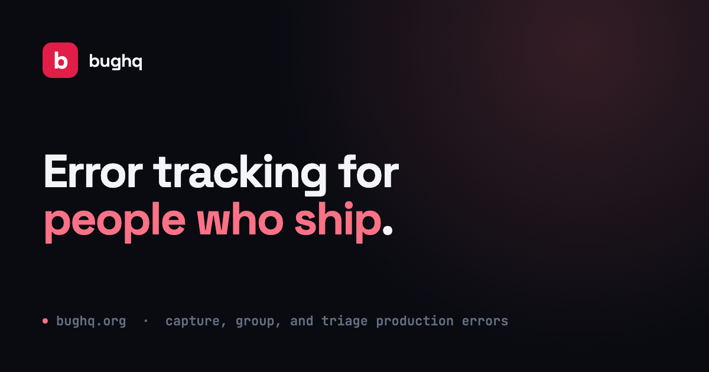
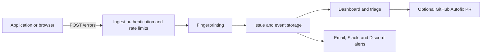

<p align="center">
  <a href="https://bughq.org">
    
  </a>
</p>

# bughq

[](https://github.com/stacksjs/bughq/actions/workflows/ci.yml)
[](https://github.com/stacksjs/bughq/actions/workflows/deploy.yml)
[](./LICENSE.md)

bughq is open source error tracking focused on the loop that matters: capture production errors, group duplicate events into issues, understand their impact, and get the right person working on a fix.

[Website](https://bughq.org) | [Documentation](https://bughq.org/docs) | [Issues](https://github.com/stacksjs/bughq/issues)

> [!NOTE]
> bughq is under active development. Interfaces and deployment details may change before the first stable release.

## What it does

- Captures browser and server errors through a public, revocable project ingest key.
- Groups related events with stable fingerprints that ignore volatile message and stack data.
- Tracks occurrence counts, affected users, environments, releases, and issue status.
- Provides project dashboards, issue detail pages, search, filters, and triage controls.
- Alerts on new issues and regressions by email, Slack, and Discord.
- Supports project members, invitations, key rotation, archiving, and deletion.
- Can connect an issue to a GitHub repository and prepare a guarded AI Autofix pull request.
- Runs as a hosted service or on infrastructure you control.

## How it works



Each event belongs to a project. The ingest path validates the project's public key, applies payload and rate limits, computes a fingerprint, and either creates a new issue or adds the event to an existing one. Alerts are delivered outside the critical ingest path so a slow notification provider does not delay error collection.

## Quick start

### Requirements

- [Bun](https://bun.sh) 1.3 or newer
- SQLite 3.47.2 or newer for local development
- PostgreSQL for the production configuration

### Run locally

```bash
git clone https://github.com/stacksjs/bughq.git
cd bughq
bun install
cp .env.example .env
./buddy key:generate
./buddy migrate
bun run dev
```

Open [http://localhost:3100](http://localhost:3100). The local development command starts the stx views server on port 3100 and the API server on port 3108.

Create an account, add a project, and copy its ingest key from project settings. Local mail uses the configured development mail driver, so invitation and alert output may be written to the application log.

## Capture an error

The built-in browser loader captures uncaught errors and unhandled promise rejections:

```html
<script
  src="http://localhost:3108/sdk.js"
  data-key="bughq_your_project_key"
  data-release="checkout@2.14.0"
  data-environment="development"
></script>
```

You can also capture an error explicitly:

```html
<script>
  bughq.capture(new Error('Checkout failed'), { cartId: 'cart_123' })
</script>
```

The ingest API accepts JSON at `POST /errors` and reads the project key from `X-BugHQ-Key`. See [routes/errors.ts](./routes/errors.ts) for the current payload handling and limits.

## Configuration

Start with `.env.example`. These are the settings most installations need to review:

| Area | Variables |
| --- | --- |
| Application | `APP_NAME`, `APP_ENV`, `APP_KEY`, `APP_URL`, `DEBUG` |
| Database | `DB_CONNECTION`, `DB_HOST`, `DB_PORT`, `DB_DATABASE`, `DB_USERNAME`, `DB_PASSWORD` |
| Mail | `MAIL_MAILER`, `MAIL_HOST`, `MAIL_PORT`, `MAIL_USERNAME`, `MAIL_PASSWORD`, `MAIL_FROM_ADDRESS` |
| Queue | `QUEUE_DRIVER`, `QUEUE_CONCURRENCY`, `QUEUE_WORKER_CONCURRENCY` |
| Billing | `STRIPE_SECRET_KEY`, `STRIPE_PUBLISHABLE_KEY`, `STRIPE_WEBHOOK_SECRET` |
| Autofix | AI provider settings in `config/ai.ts` and a server-side `GITHUB_TOKEN` |

Do not commit plaintext environment secrets. The deployment workflow reconstructs `.env.keys` from GitHub environment secrets and uses the committed encrypted environment files.

## Development commands

| Command | Purpose |
| --- | --- |
| `bun run dev` | Start the full local site and API |
| `./buddy migrate` | Apply pending database migrations |
| `./buddy generate:migrations` | Generate model-driven migration changes |
| `./buddy test` | Run the test suite |
| `bunx --bun pickier .` | Check formatting and lint rules |
| `bunx --bun pickier . --fix` | Apply safe lint and formatting fixes |
| `bun run typecheck` | Run the TypeScript checker |

Tests live in `tests/` and use Bun's test runner. The focused unit suite covers fingerprint stability, ingest authorization, and Autofix output guards.

## Project structure

| Path | Responsibility |
| --- | --- |
| `app/Errors/` | Fingerprinting, ingest authorization, limits, and alert delivery |
| `app/Autofix/` | AI analysis, repository access, and pull request workflow |
| `app/Models/` | Project, issue, event, subscription, user, and alert channel models |
| `routes/` | Ingest, issue, project, auth, billing, and Autofix endpoints |
| `resources/views/` | stx marketing pages and authenticated application views |
| `resources/partials/` | Shared stx partials |
| `database/migrations/` | Database schema history |
| `config/` | Typed application, database, mail, queue, AI, and cloud configuration |
| `tests/` | Bun unit and application tests |

bughq is built with [Stacks](https://stacksjs.org), a full-stack TypeScript framework running on Bun. Templates use stx, data access uses the Stacks ORM and query builder, and production data is stored in PostgreSQL.

## Deployment

GitHub Actions provides push-to-deploy with one branch per environment:

| Branch | Environment |
| --- | --- |
| `main` | Production |
| `stage` | Staging |
| `dev` | Development |

The workflow installs locked dependencies, provisions the encrypted environment keys, runs `buddy deploy`, updates the current release, and applies additive migrations. Deployment configuration is in [.github/workflows/deploy.yml](./.github/workflows/deploy.yml) and `config/cloud.ts`.

## Contributing

Issues and focused pull requests are welcome. Before opening a pull request:

```bash
bunx --bun pickier .
bun run typecheck
./buddy test
```

Use conventional commit messages such as `fix: guard oversized ingest payloads` or `feat: add webhook alert channel`.

## License

bughq is available under the [MIT License](./LICENSE.md).
